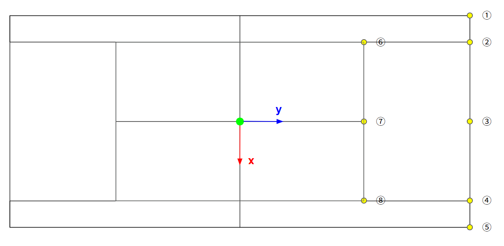

# camera_pose_estimation
## メモ
### 内部パラメータ
[[1221.73, 0, 1920],
[0, 1221.73, 960],
[0, 0, 1]]

### テニスコートサイズ
[x, y, z]
1. [5.46, 11.86, 0]
2. [4.115, 11.86, 0]
3. [0, 11.86, 0]
4. [-4.115, 11.86, 0]
5. [-5.46, 11.86, 0]
6. [4.115, 6.375, 0]
7. [0, 6.375, 0]
8. [-4.115, 6.375, 0]

